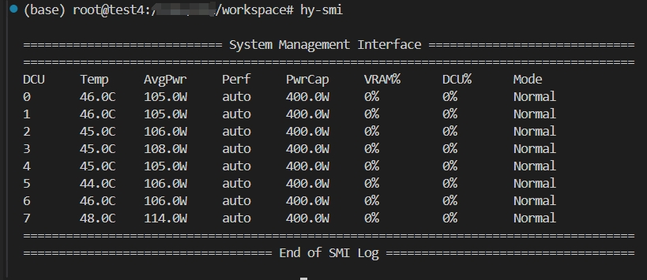

# hy-smi 使用介绍

## hy-smi 命令输出介绍

系统终端输入`hy-smi`得到如下输出:

输出内容的每一列的说明
- DCU：0-7 是卡的序号索引
- Temp：DCU卡当前运行的温度
- AvgPwr：平均功耗
- Perf：运行的性能模式
- PwrCap：额定功耗
- VARM%：显存占用率
- DCU%：核心利用率
- Mode：默认模式即为`Normal`,不建议设置其他模式(会影响性能)。

## 常用用法:

- 查看显卡名字：`hy-smi --showproductname`
- 查看当前DCU卡上运行进程占用的资源情况：`hy-smi --showpids`
- 查看指定进程在DCU卡上的资源占用情况: `hy-smi --showpiddcus`
- 查看驱动版本号：`hy-smi --showdriverversion`
- 查看`vbios`版本号：`hy-smi -v`
- 查看具体显存占用情况: `hy-smi --showmeminfo vram`

## 更多用法

更多用法请使用 `hy-smi -h`查看学习使用；