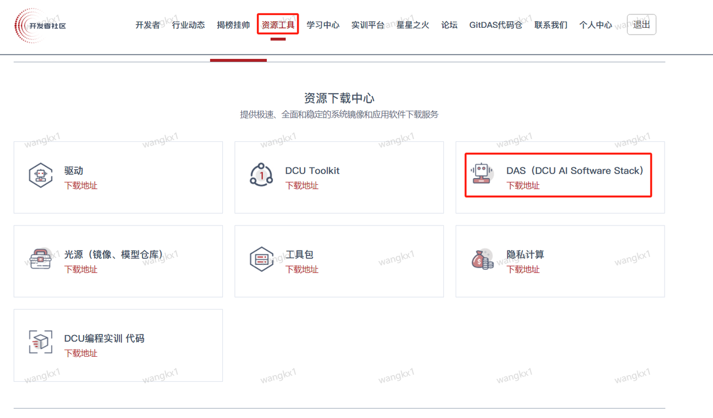

# 1 从NV的GPU迁移到DCU


## 1.1. 构建DCU基础环境

参考第一部分 `构建DCU基础环境`, 完成 DCU 基础环境构建

## 1.2. 替换深度学习算法包

对于依赖cuda的深度学习算法包，需要替换为光合开发者社区的版本;

开发者社区：[https://developer.hpccube.com/tool](https://developer.hpccube.com/tool)


<!-- <center></center> -->


**手动下载其中对应算法包的whl文件到您的服务器，安装轮子**：

参考如下步骤:

> 注意: 替换算法包的时候，算法包的版本需要和DTK对应；

1. pip 配置国内安装源
```bash
pip3 config set global.index-url https://pypi.tuna.tsinghua.edu.cn/simple
pip install pip -U
```
2. 安装轮子
```bash
pip install ***.whl 
```


## 1.3. DCU 适配案例：

**DCU开发者社区光源ModelZoo介绍**(可以快速查询所需的DCU算法模型，根据Readme进行构建DCU环境，一键运行所需的算法模型):

[https://sourcefind.cn/#/model-zoo/list](https://sourcefind.cn/#/model-zoo/list)

光源可以查询到基于多种DCU适配的各个AI技术领域的算法模型以及算法框架，如bert、yolo、resnet、Qwen、Llama、vllm、lmdpeloy等等；

**Examples：**

- [YOLOv10](https://sourcefind.cn/#/model-zoo/1802637886774013954)
- [Rep_Vit](https://sourcefind.cn/#/model-zoo/1805170476575846402)
- [alphafold2_jax](https://sourcefind.cn/#/model-zoo/1712346117256200194)
- [llama3](https://sourcefind.cn/#/model-zoo/1782218524112154626)
- [stablediffusion_v2.1](https://sourcefind.cn/#/model-zoo/1793173002231443458)
- [Qwen1.5](https://sourcefind.cn/#/model-zoo/1793160576505180161)