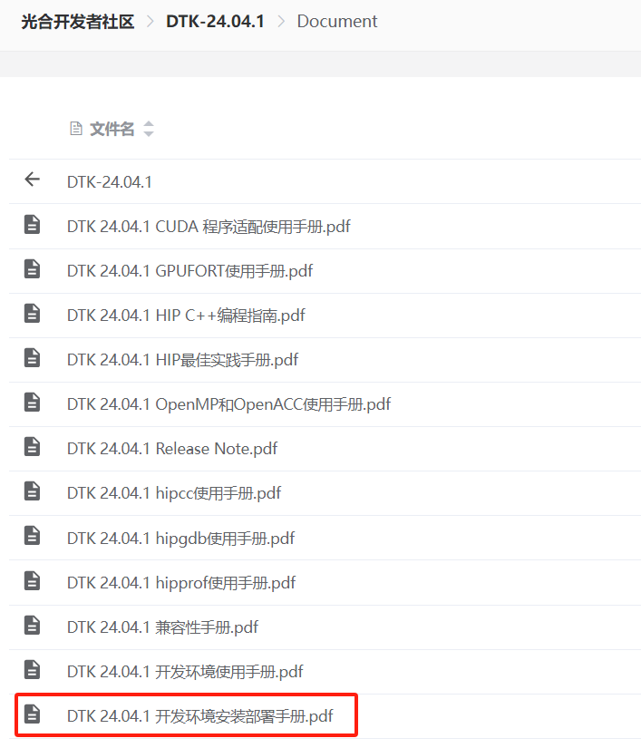

# 构建DCU基础环境

## DCU 环境安装手册

开发者社区的环境搭建文档:
[https://cancon.hpccube.com:65024/1/main/DTK-24.04/Document](https://cancon.hpccube.com:65024/1/main/DTK-24.04/Document)

建议参考如下文档进行安装DCU基础环境：


## 安装驱动

**注意**
> 注意DTK和rock驱动有对应关系，可参考[dcu-环境安装手册](#dcu-环境安装手册)提出，一般都安装最新的就行；

下载链接: [https://cancon.hpccube.com:65024/6/main](https://cancon.hpccube.com:65024/6/main)

`https://developer.hpccube.com/tool/` → 驱动 → latest 驱动→ rock-xxx-xxx.aio.run

1. 安装 DCU 加速卡驱动

```bash
chmod 755 rock-5.7.1-6.2.13-V1.0.1a.aio.run
./rock-5.7.1-6.2.13-V1.0.1a.aio.run
```
2. 重启机器

```bash
reboot
```

3. 查看验证是否安装成功
```bash
# 出现如下类似结果则安装成功
[root@b04r3n02 ~]# lsmod | grep hydcu
hydcu           1435342     0
hydcu_sched     34432       1   hydcu
hyttm           61919       1   hydcu
hykcl           46567       3   hydcu_sched,hydcu,hyttm
hy_extra        32140       3   hydcu_sched,hydcu,hykcl
amd_iommu_v2    18821       1   hydcu
drm_kms_helper  179394      3   ast,hydcu,hykcl
drm             429744      8   ast,ttm,hydcu,hykcl,hyttm,drm_kms_helper
```


## 安装DTK

DTK 下载链接：[https://cancon.hpccube.com:65024/1/main](https://cancon.hpccube.com:65024/1/main)

`https://developer.hpccube.com/tool/` → DTK Toolkit → DTK-24.04.1 → 对应的操作系统 → DTK-24.04.1-CentOS7.6-x86_64.tar.gz

1. 安装
```bash
# 解压安装
tar xvf DTK-24.04.1-CentOS7.6-x86_64.tar.gz -C /opt
# 创建软连接
ln -s /opt/dtk-24.04.1 /opt/dtk
```

3. 设置 DTK 环境变量
> DTK 压缩文件中提供了设置环境变量脚本 env.sh。可以通过 source
/opt/dtk/env.sh 的方式临时加载环境变量。为避免多次配置，常用以下方式加载环
境变量

```bash
echo "source /opt/dtk/env.sh">> ~/.bashrc
# 激活环境变量
source  ~/.bashrc
```

4. 验证 DCU 环境
```bash
#查看并执行 hy-smi 或者 rocm-smi 指令查看 dcu 基本信息
[root@h01r4n04~]# rocm-smi
# 出现如下内容, 则安装成功
===================System Management Interface =================
==========================================================
DCU Temp AvgPwr Fan Perf PwrCap VRAM% DCU%
0 50.0c 55.0W 0.0% auto 450.0W 0% 0%
1 50.0c 58.0W 0.0% auto 450.0W 0% 0%
2 49.0c 58.0W 0.0% auto 450.0W 0% 0% 
3 49.0c 55.0W 0.0% auto 450.0W 0% 0%
==========================================================
======================End of SMI Log========================
```

## DTK和DAS(AI生态包)兼容性

**注意:**
>  不兼容的版本可能出现严重的环境问题

| DTK版本 | DAS版本 |
| ------- | ------- |
|DTK-24.04.1 | DAS1.1 |
|DTK-24.04   | DAS1.0  |