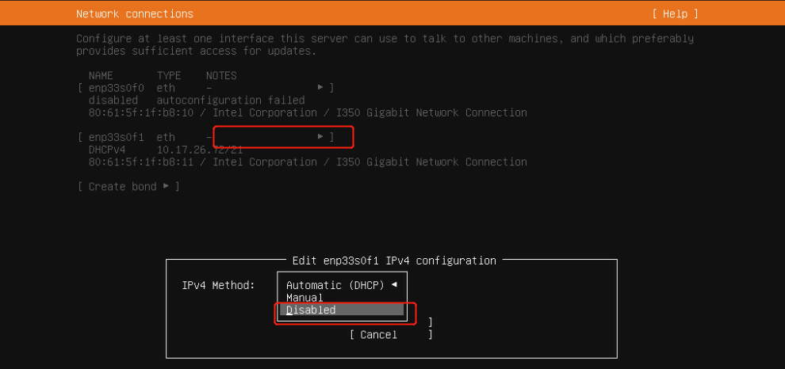
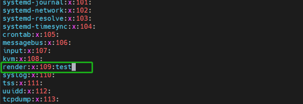

### **1.3 DCU基础环境完整教程-ubuntu**:

#### 1.3.1. **安装系统过程中注意:**
> Ubuntu20.04.1（5.4.0-42-generic）和Ubuntu22.04.1（5.15.0-25-generic）已在 DCU 上进行全量验证，本文以Ubuntu20.04.1（5.4.0-42-generic）安装部署为例，如果是其他版本或者kernel不一致可能导致驱动无效
  
   1. 安装时不要连接网络（直接断掉网线或者在安装系统时将网络disable），否则会自动升级内核(<font color="red">即使选择了不更新操作</font>)。

    安装系统时将网络disable；
  
   

   2. 安装过程中, 涉及到更新的选项都选择不更新;


#### 1.3.2. **安装完成系统后的配置**
   1. 安装完系统后确定内核, 是否符合兼容性, 如果不符合兼容性, 
        ```shell
        root@test79:/mnt# uname -r
        5.4.0-173-generic
        ```
       建议确认
       - 使用的操作系统版本是否在兼容性列表;
       - 是否在安装操作系统中禁用网络，选择不更新的相关配置; 

   2. 确保非root用户已加入`video`组，以便能够使用DCU;

       - 确保非root用户已加入`video`组，以便能够使用DCU, shell 命令修改;

            ```shell
            # 对于有sudo权限的非root用户
            sudo usermod -aG video $USER
            
            # 对于无sudo权限的用户，由root执行
            usermod -aG video <userid>
            ```

       - 或者，或者修改/etc/group文件，添加test用户;

            
            
            退出重新登录。

   3. 关闭内核自动更新: 
       - 查看安装内核：
            ```shell
            dpkg --list | grep linux-image
            dpkg --list | grep linux-headers
            dpkg --list | grep linux-modules


            # 输出结果:-----------------------------------------------------------------------------------------------------------
            ii  linux-image-5.4.0-173-generic         5.4.0-173.191                     amd64        Signed kernel image generic
            hi  linux-image-5.4.0-42-generic          5.4.0-42.46                       amd64        Signed kernel image generic
            ii  linux-image-generic                   5.4.0.173.171                     amd64        Generic Linux kernel image
            ```

       - 禁止内核更新方法1:
            ```shell
            sudo vi /etc/apt/apt.conf.d/10periodic
            sudo vi /etc/apt/apt.conf.d/20auto-upgrades
            # 后面部分全部改成 “0”


            # 修改后内容 ----------------------------------------
            # 10periodic
            APT::Periodic::Update-Package-Lists "0";
            APT::Periodic::Download-Upgradeable-Packages "0";
            APT::Periodic::AutocleanInterval "0";
            # 20auto-upgrades
            APT::Periodic::Update-Package-Lists "0";
            APT::Periodic::Unattended-Upgrade "0";
            ```
       - 禁止内核更新方法2:

            直接使用hold参数，固定内核版本：
            ```shell
            sudo apt-mark hold linux-image-5.4.0-42-generic
            sudo apt-mark hold linux-headers-5.4.0-42-generic
            sudo apt-mark hold linux-modules-extra-5.4.0-42-generic
            ```

            查询 Ubuntu系统被锁定不更新的软件包状态(hold)
            ```shell
            sudo dpkg --get-selections | grep hold
            ```

#### 1.3.3. **更新国内软件下载源:**

   1. 备份源文件：

        ```shell
        sudo cp /etc/apt/sources.list /etc/apt/sources.list.bak
        ```

   2. 修改源文件sources.list: 将原文件内容全部注释或删掉，添加以下内容;

        ```shell
        # 当前使用阿里源, 如果想使用其他源, 可以自行在网上搜索其他源的配置文件，并替换掉以下内容;
        # 注意换源的时候需要和操作系统的版本号作匹配
        deb http://mirrors.aliyun.com/ubuntu/ focal main restricted universe multiverse
        deb-src http://mirrors.aliyun.com/ubuntu/ focal main restricted universe multiverse

        deb http://mirrors.aliyun.com/ubuntu/ focal-security main restricted universe multiverse
        deb-src http://mirrors.aliyun.com/ubuntu/ focal-security main restricted universe multiverse

        deb http://mirrors.aliyun.com/ubuntu/ focal-updates main restricted universe multiverse
        deb-src http://mirrors.aliyun.com/ubuntu/ focal-updates main restricted universe multiverse

        deb http://mirrors.aliyun.com/ubuntu/ focal-proposed main restricted universe multiverse
        deb-src http://mirrors.aliyun.com/ubuntu/ focal-proposed main restricted universe multiverse

        deb http://mirrors.aliyun.com/ubuntu/ focal-backports main restricted universe multiverse
        deb-src http://mirrors.aliyun.com/ubuntu/ focal-backports main restricted universe multiverse
        ```

        如果是ubuntu-22.04可以直接使用如下方式, 更换为华为源;

        ```shell
        # 修改为华为源
        sudo sed -i "s@http://.*archive.ubuntu.com@http://repo.huaweicloud.com@g" /etc/apt/sources.list
        sudo sed -i "s@http://.*security.ubuntu.com@http://repo.huaweicloud.com@g" /etc/apt/sources.list
        ```


   3. 更新:

        ```shell
        sudo apt-get update 	
        ```

#### 1.3.4. **安装相关依赖:**
   - 联网执行以下命令安装必要的依赖包：

        ```shell
        # 安装 DCU 加速卡驱动所需的依赖包命令
        sudo apt-get install -y cmake gcc autoconf linux-kernel-headers kernel-package automake linux-modules-extra-`uname -r` linux-image-`uname -r` linux-headers-`uname -r`

        # 安装 DTK 开发环境所需的依赖包命令
        sudo apt-get install -y make gcc g++ cmake git wget gfortran elfutils libdrm-dev 
        sudo apt-get install -y kmod libtinfo5 sqlite3 libsqlite3-dev libelf-dev libibverbs1 libgtk2.0-0
        sudo apt-get install -y libnuma-dev libgl1-mesa-dev rpm rsync mesa-common-dev apt-utils
        sudo apt-get install -y cmake libpci-dev pciutils libpciaccess-dev libbabeltrace-dev pkg-config
        sudo apt-get install -y libfile-which-perl libfile-basedir-perl libfile-copy-recursive-perl libfile-listing-perl
        sudo apt-get install -y python3 python3-pip python3-dev python3-wheel
        sudo apt-get install -y gettext gettext-base libprotobuf-dev tcl
        sudo apt-get install -y libio-digest-perl libdigest-md5-file-perl libdata-dumper-simple-perl vim curl libcurlpp-dev
        sudo apt-get install -y doxygen graphviz texlive libncurses5 msgpack*
        sudo apt install mlocate
        ```

   - 离线安装依赖:
    <br>
        依赖离线包：deb_DTK2404_Ubuntu20.04.1_5.4.0-42-generic.tar
    <br>
        链接：https://pan.baidu.com/s/1jnWfddL4lHWVQb3btD34Iw?pwd=wj6q
    <br>
        提取码：wj6q
    <br>
        下载好导入服务器，进行解压：
    <br>
        1. `vi /etc/apt/sources.list.d/myrepo.list`，输入如下内容，注意修改解压的路径，下面配置是在/data路径下解压的;

            ```shell
            vi /etc/apt/sources.list.d/myrepo.list
            #输入如下内容，注意修改解压的路径，下面配置是在/data路径下解压的
            deb [trusted=yes] file:///data/my-debian-packages ./
            #保存退出即可

            chmod +r /data
            chown -R _apt:root /datahR
            chown -R man:root /var/cache/man
            #更新系统的apt缓存，使其能够识别并使用新添加的本地私有源
            apt update
            apt-get install udev
            apt install mlocate
            ```

        更新了之后，就可以通过`apt install`安装依赖包了。

#### 1.3.5. **校验系统配置:**

| 设备名称 | 设备码 |
| -----   | ----- |
| Z100L  | 1d94:55b7 |
| K100   | 1d94:62b7 |
| K100_AI | 1d94:6210 |

- 查看DCU设备

```shell
# Z100L
root@sugontest79:/mnt#lspci -nn |grep -i 55b7
------------------------------------------------------------------------------------------------------
07:00.0 Display controller [0380]: Chengdu Haiguang IC Design Co., Ltd. ZIFANG [1d94:55b7] (rev 01)
0a:00.0 Display controller [0380]: Chengdu Haiguang IC Design Co., Ltd. ZIFANG [1d94:55b7] (rev 01)
------------------------------------------------------------------------------------------------------

# K100
root@sugontest79:/mnt#lspci -nn |grep -i 62b7
------------------------------------------------------------------------------------------------------
07:00.0 Co-processor [0b40]: Chengdu Haiguang IC Design Co., Ltd. KONGMING [1d94:62b7] (rev 01)
0a:00.0 Co-processor [0b40]: Chengdu Haiguang IC Design Co., Ltd. KONGMING [1d94:62b7] (rev 01)
------------------------------------------------------------------------------------------------------

# K100-AI
root@sugontest79:/mnt#lspci -nn |grep -i 6210
------------------------------------------------------------------------------------------------------
07:00.0 Co-processor [0b40]: Chengdu Haiguang IC Design Co., Ltd. KONGMING [1d94:6210] (rev 01)
0a:00.0 Co-processor [0b40]: Chengdu Haiguang IC Design Co., Ltd. KONGMING [1d94:6210] (rev 01)
------------------------------------------------------------------------------------------------------

```

> 注：输出信息可能和截图不完全一致。


#### 1.3.6. **安装驱动:**

**注意：**
> DTK和rock驱动有对应关系，可参考[dcu-环境安装手册](#DCU环境安装手册)，推荐安装最新的使用<br>
> -安装驱动之前需要安装基础包，包括cmake、gcc等多种基础依赖包，请先参考`DCU环境安装手册`完成基础环境包的安装。


**驱动下载地址**:  [https://cancon.hpccube.com:65024/6/main](https://cancon.hpccube.com:65024/6/main) → latest 驱动→ rock-xxx-xxx.aio.run


1. 安装 DCU 加速卡驱动

    ```bash
    chmod 755 rock-5.7.1-6.2.13-V1.0.1a.aio.run
    ./rock-5.7.1-6.2.13-V1.0.1a.aio.run
    ```

2. 如果安装过程更新了`vbios`, 则需要重启机器

    ```bash
    reboot
    ```

3. 查看验证是否安装成功

    ```bash
    # 出现如下类似结果则安装成功
    [root@b04r3n02 ~]# lsmod | grep hydcu
    hydcu           1435342     0
    hydcu_sched     34432       1   hydcu
    hyttm           61919       1   hydcu
    hykcl           46567       3   hydcu_sched,hydcu,hyttm
    hy_extra        32140       3   hydcu_sched,hydcu,hykcl
    amd_iommu_v2    18821       1   hydcu
    drm_kms_helper  179394      3   ast,hydcu,hykcl
    drm             429744      8   ast,ttm,hydcu,hykcl,hyttm,drm_kms_helper
    ```

4. 卸载驱动步骤：

    <br>
    如遇到异常情况或需要更新版本，先执行驱动卸载。
    <br>

    ```shell
    rpm -qa | grep rock   #查询安装的驱动版本
    rmmod hydcu
    rpm -e rock-5.7.1-6.2.18-1.x86_64
    ```


#### 1.3.7. **安装DTK:**
   
**DTK下载地址**:  [https://cancon.hpccube.com:65024/1/main](https://cancon.hpccube.com:65024/1/main)  → latest → 对应的操作系统 → DTK-version-OS-version-x86_64.tar.gz


1. 安装

    ```bash
    # 解压安装
    tar xvf DTK-24.04.1-CentOS7.6-x86_64.tar.gz -C /opt
    # 创建软连接
    ln -s /opt/dtk-24.04.1 /opt/dtk
    ```

3. 设置 DTK 环境变量

    > DTK 压缩文件中提供了设置环境变量脚本 env.sh。可以通过 source /opt/dtk/env.sh 的方式临时加载环境变量。为避免多次配置，常用以下方式加载环境变量

    ```bash
    echo "source /opt/dtk/env.sh">> ~/.bashrc
    # 激活环境变量
    source  ~/.bashrc
    ```

4. 验证 DCU 环境

    ```bash
    # 查看并执行 hy-smi 或者 rocm-smi 指令查看 dcu 基本信息
    [root@h01r4n04~]# rocm-smi
    # 出现如下内容, 则安装成功
    ===================System Management Interface =================
    ==========================================================
    DCU Temp AvgPwr Fan Perf PwrCap VRAM% DCU%
    0 50.0c 55.0W 0.0% auto 450.0W 0% 0%
    1 50.0c 58.0W 0.0% auto 450.0W 0% 0%
    2 49.0c 58.0W 0.0% auto 450.0W 0% 0% 
    3 49.0c 55.0W 0.0% auto 450.0W 0% 0%
    ==========================================================
    ======================End of SMI Log========================
    ```

#### 1.3.8. **验证安装结果:**

1. 使用`rocminfo`命令检查ROCm系统状态

    <br>
    终端输入如下内容:
    <br>

    ```shell
    rocminfo | grep gfx

    # 其中Z100/Z100L为gfx906，K100为gfx926，K100_AI为gfx928; 有输出即说明驱动和DTK安装成功
    ------------------------------------------------------------------------------------------------------------
        Name:                    amdgcn-amd-amdhsa--gfx906:sramecc+:xnack-
        Name:                    amdgcn-amd-amdhsa--gfx906:sramecc+:xnack-
        Name:                    amdgcn-amd-amdhsa--gfx906:sramecc+:xnack-
        Name:                    amdgcn-amd-amdhsa--gfx906:sramecc+:xnack-
        Name:                    amdgcn-amd-amdhsa--gfx906:sramecc+:xnack-
        Name:                    amdgcn-amd-amdhsa--gfx906:sramecc+:xnack-
        Name:                    amdgcn-amd-amdhsa--gfx906:sramecc+:xnack-
        Name:                    amdgcn-amd-amdhsa--gfx906:sramecc+:xnack-
    ```
    <br>

2. 运行`hy-smi`或`rocm-smi`来监控DCU的状态和性能指标；

    ```shell
    # 查看并执行 hy-smi 或者 rocm-smi 指令查看 dcu 基本信息
    [root@h01r4n04~]# rocm-smi
        # 出现如下内容, 则安装成功
    ============================ System Management Interface =============================
    ======================================================================================
    DCU     Temp     AvgPwr     Perf     PwrCap     VRAM%      DCU%      Mode     
    0       42.0C    39.0W      auto     280.0W     0%         0%        Normal   
    1       41.0C    39.0W      auto     280.0W     0%         0%        Normal   
    2       41.0C    36.0W      auto     280.0W     0%         0%        Normal   
    3       40.0C    38.0W      auto     280.0W     0%         0%        Normal   
    4       40.0C    39.0W      auto     280.0W     0%         0%        Normal   
    5       41.0C    41.0W      auto     280.0W     0%         0%        Normal   
    6       42.0C    37.0W      auto     280.0W     0%         0%        Normal   
    7       41.0C    36.0W      auto     280.0W     0%         0%        Normal   
    ======================================================================================
    =================================== End of SMI Log ===================================
    ```
